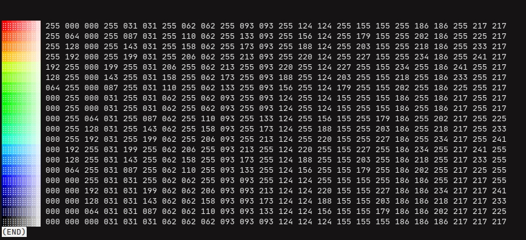

# Palette Print Bash 
> _ANSI palette in your bash terminal!_

Prints specified range of colors and its brightness

## Install
Download and drop the script into appropriate folder. Then either source insde `.{zsh|bash}rc` file or put into right `/binary` folder.

```bash
# .zshrc
$ . /path/to/palette.bash 
```

```bash
$ mv /downloads/palette.bash $HOME/.local/bin # XDG default
$ mv /downloads/palette.bash /usr/local/bin   # Others 
```

## Usage:
To print the palette 
```bash
$   palette.bash [[brightness] [colors]] [legend_radix]
$ ./palette.bash ...
# brightness    - Any int from 0 to 255 
# colors        - Any int from 0 to 255 
# legend_radix  - 16 or 10
```

### Commands

| Command | Shortcut | Description |
|-|-|-|
|`palette.bash help `     |   | show help |
|`palette.bash cache`     |   | clear cache |
|`palette.bash examples`  | x | show examples |
|`palette.bash --version` | v | print version |

## How it works? 

Under hood it uses ANSI escape codes to print the palette.

## License
See `palette.bash` file.

## See also 
* `$ man console_codes`

----

 Copyright (C) 2021- hinell@github.com